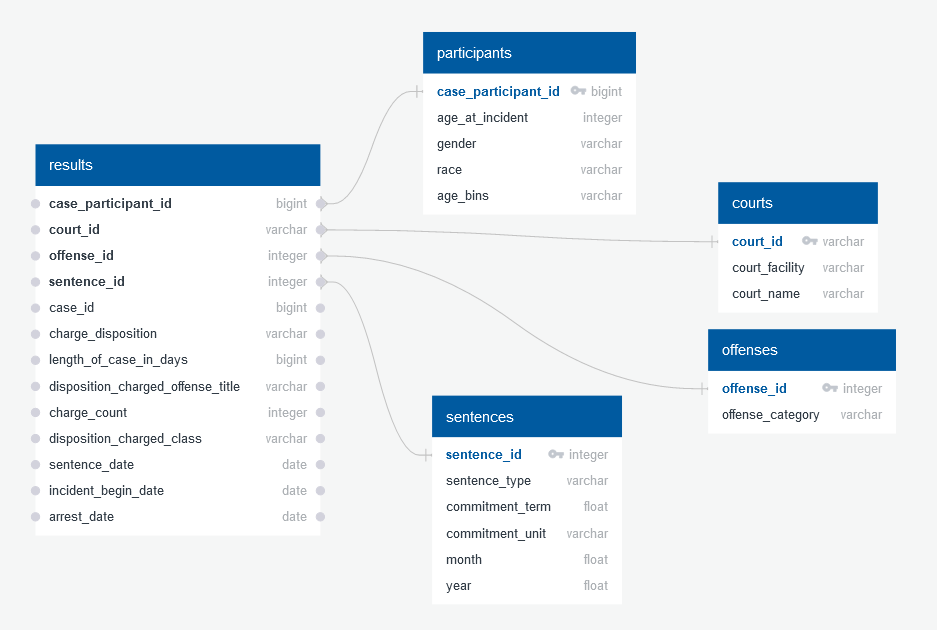

# CCSAO-Sentencing

This repository houses the code for a data visualization dashboard analyzing judicial sentencing data for felony cases processed by the Cook County State's Attorneys Office (CCSAO) in Cook County, Illinois. For the purposes of this project, the data has been filtered to only include cases from 2010-2019.

## Collaborators
* Cristina Bardan
* Purvi Patel

## Background
[In late 2017](https://www.cookcountystatesattorney.org/news/cook-county-state-s-attorney-kim-foxx-announces-release-office-s-first-online-data-report), the State’s Attorney (judicial prosecutor’s office) in Cook County, Illinois – where the city of Chicago is located – made public a series of unfiltered datasets on all felony criminal cases processed in Cook County as part of an initiative to increase transparency in the criminal justice system. The case-level datasets contain anonymized information about every felony case processed by the State’s Attorney’s Office (SAO) dating back to roughly 2010, and have been provided for free so that any person or group can analyze the data and share the results publicly.

There are 4 datasets, representing the four stages of interaction with the SAO during the legal process:
1. INTAKE – initial investigations, potential cases for prosecution
2. INITIATION – start of the legal process for cases that the SAO decides to prosecute
3. DISPOSITION – the results of the fact-finding process and final outcome of the case
4. SENTENCING – penalties imposed on cases found “guilty”

For this project, the group proposed to focus on analysis of ONE of the datasets (Sentencing), with a focus on specific topics related to sentencing outcomes. The project tried to take advantage of a dataset publicly available for free in both downloadable format (csv) and through an API url.  There is a strong interest by the SAO in Cook County to encourage the public to analyze the data, but the SAO does not have the resources to do this analysis directly.

This particular project has been coded with both Python and Javascript, with the majority of work being coded collaboratively over Zoom. A similar project (coded in R) on narcotics vs. non-narcotics cases from the Dispositions dataset was analyzed by [Nick Jones](https://github.com/nrjones8?tab=repositories) for cases from 2011-2016, and can be found [here](https://github.com/nrjones8/cook-county-states-attorney).

## Data
For this project, we wanted to specifically analyze the sentencing dataset from Cook County State’s Attorney’s Office (CCSAO). The sentencing data reported by CCSAO ([found here](https://datacatalog.cookcountyil.gov/Courts/Sentencing/tg8v-tm6u)) reflects the judgment imposed by the court on people that have been found guilty. Each row represents a charge that has been sentenced. An downloadable glossary of of key terms within the dataset can also be [Sentencing dataset's page](https://datacatalog.cookcountyil.gov/Courts/Sentencing/tg8v-tm6u). 

The following diagram explains the relationship of each data set to the overall judicial process for such cases.  The information from the sentencing dataset relates to the steps of the process highlighted in blue. 

## Data Cleaning
Given the sheer size of the dataset and the amount of information included, it was necessary to perform a large amount of data cleaning in order to tailor the data to the specific areas of analysis we wanted to explore.  Many data-cleaning decisions were based on the fact that the project was originally targeted to an audience of data analysts and programmers without a detailed knowledge of the State of Illinois judicial system, not to legal or law enforcement professionals.  

All data cleaning was performed in the `new.ipynb` as detailed below, and saved in the 'ETL-backend' folder.

The final database was saved in SQLite, with four tables (participants, courts, offenses, and sentences) feeding into a central results table, as shown in the Entity Relationship Diagram (ERD) below:

### Selecting data features to keep
After initial discussion, we decided on several points of analysis we wanted to explore, such as comparisons final sentence lengths to demographics and category of offense.  Other suggestions for additional analysis included:

* A demographic analysis of persons determined guilty of a felony charge (i.e. age, race, gender)
* An analysis of the types of sentences imposed, possibly disaggregated by type of offense
* An evaluation of the total time needed in the judicial process to arrive at the final sentence
* An evaluation of the number of guilty findings and types of sentences grouped by the court or district where the case was processed

Based on these areas, we decide to limit the dataset to teh following columns/data points, which are defined on the [Cook County open data website](https://datacatalog.cookcountyil.gov/Courts/Sentencing/tg8v-tm6u):
* case id
* case participant id
* charge id
* charge version id
* court facility
* court name
* age at incident
* gender
* race
* charge disposition
* length of case in days
* current sentence
* primary charge
* sentence date
* offense category
* commitment term
* commitment unit
* sentence type

### Addressing gaps with older data and avoiding double counting
It appears that some data for older cases was not collected or not preserved, and at some point data was converted from prior systems into the current system.  Missing data appears as 'PROMIS conversion' or 'conversion' in the current data set. We first decided to limit analysis to cases sentenced from 2015-2019, in order to limit the number of cases with these conversion gaps.  For remaining cases, we converted these "conversion" entries to empty values and ran a drop NA to clear them from the data set. 

We also decided to drop data on lesser charges, keeping only sentencing data on the primary charge for any given case. We also decided to avoid double counting cases by keeping only the 'current sentence', and thus eliminating prior sentences that had been revised. 

### Consolidation of categories within data columns
Given that our primary audience was not an audience trained on the legal system, we decided it was acceptable to eliminate some of the more detailed nuances of the data in order to consolidate information into more generalized categories.  

The most difficult consolidation was consolidation of 88 offense categories into 20 categories.  We settled on the following:

|Final Category|Original Categories Included|
|:---:|:---:|
|Homicide|Homicide, Attempt Homicide, Reckless Homicide|
|Offenses Against Police Officers|Aggravated Assault Police Officer, Aggravated Assault Police Officer Firearm, Police Shooting, Impersonating Police Officer, Aggravated Battery Police Officer, Aggravated Battery Police Officer Firearm, Disarming Police Officer|
|Battery|Battery, Aggravated Battery, Aggravated Battery With A Firearm, Domestic Battery|
|Robbery/Burglary/Theft|Aggravated Identity Theft, Aggravated Robbery, Aggravated Robbery BB Gun, Armed Robbery, Attempt Armed Robbery, Burglary, Identity Theft, Residential Burglary, Retail Theft, Robbery, Theft, Theft by Deception, Possession Of Burglary Tools|
|Arson|Arson, Arson and Attempt Arson, Attempt Arson|
|Firearms and Explosives|Aggravated Discharge Firearm, Armed Violence, Gun Running, Possession of Explosives, UUW - Unlawful Use of Weapon, Gun - Non UUW, Bomb Threat, Reckless Discharge of Firearm|
|Motor Vehicle Offenses|Aggravated DUI, Attempt Vehicular Hijacking, DUI, Driving With Suspended Or Revoked License, Major Accidents, Possession of Stolen Motor Vehicle, Vehicular Hijacking, Vehicular Invasion|
|Judicial Process Violations|Communicating With Witness, Escape - Failure to Return, Obstructing Justice, Perjury, Tampering, Violate Bail Bond, Violation Order Of Protection|
|Sex Offenses|Attempt Sex Crimes, Child Pornography, Failure to Register as a Sex Offender, Pandering, Prostitution, Sex Crimes, Violation of Sex Offender Registration|
|Human Trafficking/Detention/Kidnapping|Child Abduction, Human Trafficking, Kidnapping, Unlawful Restraint|
|Trespassing|Trespassing, Home Invasion, Criminal Trespass To Residence|
|Fraud/Deception|Credit Card Cases, Deceptive Practice, Forgery, Fraud, Fraudulent ID|
|Corruption|Intimidation, Official Misconduct, Bribery|
|Inside Penal Institutions|Possession of Contraband in Penal Institution, Possession of Shank in Penal Institution|
|Other Offense|Dog Fighting, Gambling,‘Failure To Pay Child Support, Compelling Gang Membership|
|Narcotics|*Left as its own separate category*|
|Aggravated Fleeing and Eluding|*Left as its own separate category*|
|Criminal Damage to Property|*Left as its own separate category*|
|Stalking|*Left as its own separate category*
|Hate Crimes|*Left as its own separate category*|

## Contents

