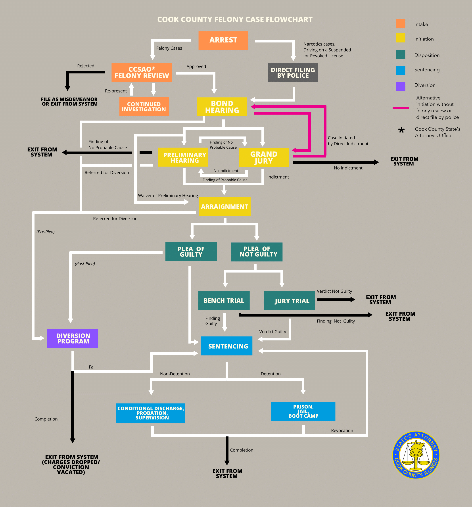

# CCSAO-Sentencing

This repository houses the code for a data visualization dashboard analyzing judicial sentencing data for felony cases processed by the Cook County State's Attorneys Office (CCSAO) in Cook County, Illinois. For the purposes of this project, the data has been filtered to only include cases from 2010-2019.

## Background
[In late 2017](https://www.cookcountystatesattorney.org/news/cook-county-state-s-attorney-kim-foxx-announces-release-office-s-first-online-data-report), the State’s Attorney (judicial prosecutor’s office) in Cook County, Illinois – where the city of Chicago is located – made public a series of unfiltered datasets on all felony criminal cases processed in Cook County as part of an initiative to increase transparency in the criminal justice system. The case-level datasets contain anonymized information about every felony case processed by the State’s Attorney’s Office (SAO) dating back to roughly 2010, and have been provided for free so that any person or group can analyze the data and share the results publicly.

There are 4 datasets, representing the four stages of interaction with the SAO during the legal process:
1. INTAKE – initial investigations, potential cases for prosecution
2. INITIATION – start of the legal process for cases that the SAO decides to prosecute
3. DISPOSITION – the results of the fact-finding process and final outcome of the case
4. SENTENCING – penalties imposed on cases found “guilty”

For this project, the group proposed to focus on analysis of ONE of the datasets (Sentencing), with a focus on specific topics related to sentencing outcomes, such as:
* A demographic analysis of persons found “guilty” of a felony charge (i.e. age, race, gender)
* An analysis of the types of sentences imposed, possibly disaggregated by type of offense
* An evaluation of the total time needed in the judicial process to arrive at the final sentence
* An evaluation of the number of guilty findings and types of sentences grouped by the court or district where the case was processed
  
The project tried to take advantage of a dataset publicly available for free in both downloadable format (csv) and through an API url.  There is a strong interest by the SAO in Cook County to encourage the public to analyze the data, but the SAO does not have the resources to do this analysis directly.

This particular project has been coded with both Python and Javascript. A simlar project (coded in R) on narcotics vs. non-narcotics cases from the Dispositions dataset was analyzed by [Nick Jones](https://github.com/nrjones8?tab=repositories) for cases from 2011-2016, and can be found [here](https://github.com/nrjones8/cook-county-states-attorney).

## Data
For this project, we wanted to specifically analyze the sentencing dataset from Cook County State’s Attorney’s Office (CCSAO). The sentencing data reported by CCSAO ([found here](https://datacatalog.cookcountyil.gov/Courts/Sentencing/tg8v-tm6u)) reflects the judgment imposed by the court on people that have been found guilty. Each row represents a charge that has been sentenced. An downloadable glossary of of key terms within the dataset can also be [Sentencing dataset's page](https://datacatalog.cookcountyil.gov/Courts/Sentencing/tg8v-tm6u). 

The following diagram explains the relationship of each data set to the overall judicial process for such cases.  The information from the sentencing dataset relates to the steps of the process highlighted in blue. 

## Data Cleaning

## Contents

